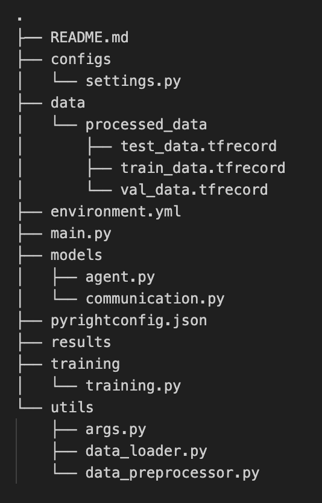

# Emergent Language in Multi-Step Bidirectional Reference Game

## Description

## Project Set-Up

1. Setting up the environment. 
    * Recreate the environment: ``conda env create --name myenv --file environment.yml``
    * Activate conda env: ``conda activate --name``

2. Large ``data/`` and ``results/`` folders are pushed with ``.gitignore``. Clone the repository to see the folders.

## Reposetory Strucure

**Notes:**
- The ``data_loader.py`` loads ``coco_captions`` dataset, extracts features with ResNet50, and saves ``train``, ``test`` and ``val`` datasets as ``{ds}.tfrecord`` files. You can skip this step.
- The rest is executed via ``main.py``.

    * Run `python3 main.py` to execute the whole project:
        - `data_preprocessor.py` creates `R1` and `R2` image feature subsets along with one-hot encoded target vectors `t1` and `t2` that the model will be trained on;
        - `agent.py` runs the agent models;
        - `communication.py` is responsible for agent communication;
        - `training.py` is for training as well as evaluaton the test and validation datasets. It will also produce visualizations.
        - `args.py` sets the hyperparameters as lerning rate, number of epochs and batch sizes;
        - `settings.py` you can manually adjust other model parameters, such as embedding_size, scaling_factor, etc.

5. python main.py --learning-rates 0.001 0.0001 --batch-sizes 32 64 --epochs 50 100
